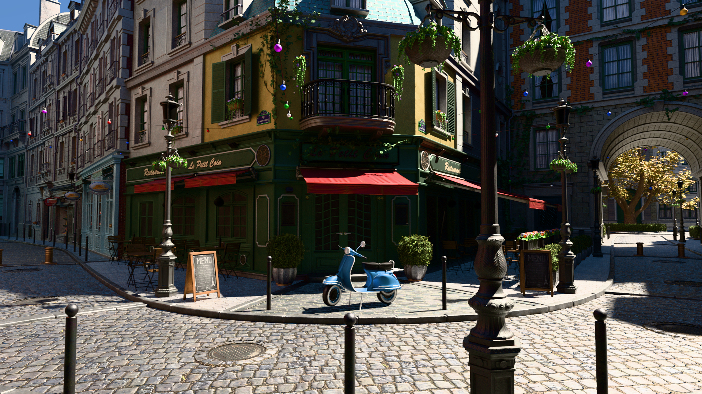
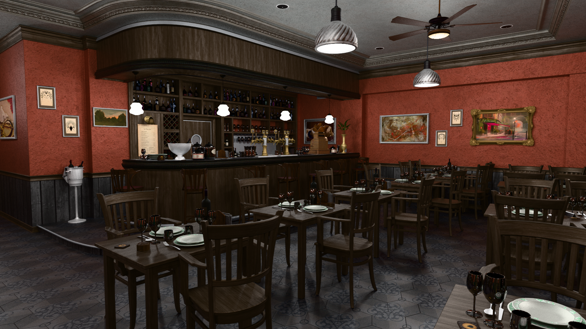
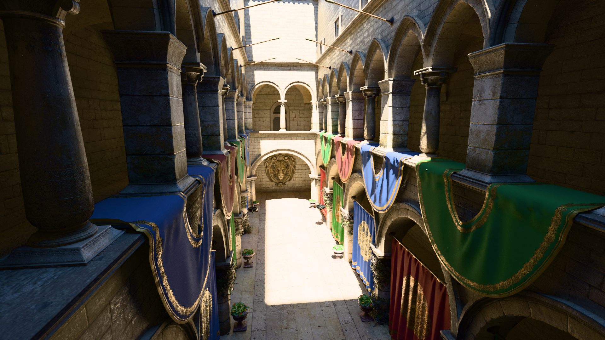
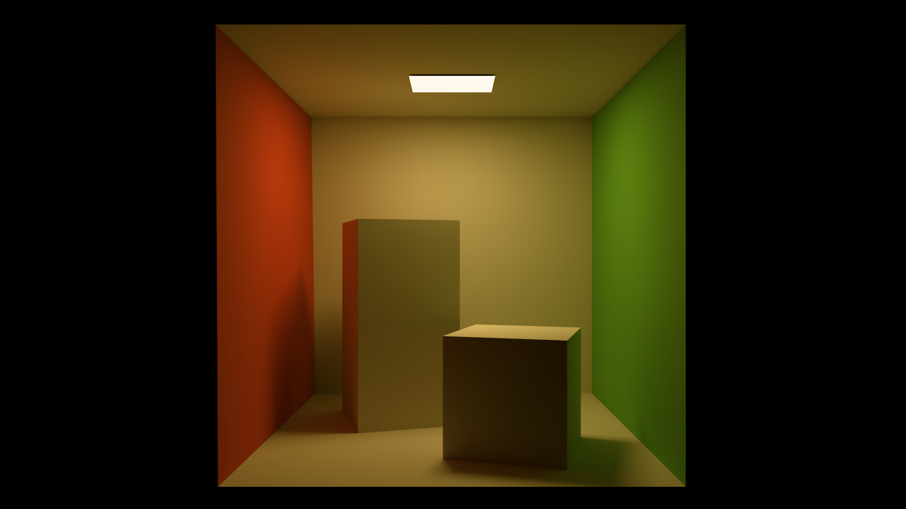

# ⚡ Hardware Accelerated Ray Tracer (HWRT)
> A high performance, physically based, progressive **Path Tracer** built from scratch using **C++20** and **Vulkan**.


[](https://www.vulkan.org/)
[](https://isocpp.org/)

## 🖼️ Showcase
<p align="center">
  
  <em>Amazon Lumberyard Bistro (exterior)</em>
</p>
<p align="center">
  
  <em>Amazon Lumberyard Bistro (interior)</em>
</p>
<p align="center">
  
  <em>Crytek Sponza</em>
</p>
<p align="center">
  
  <em>Cornell Box</em>
</p>

## ✨ Features
* Vulkan Ray Tracing Pipeline
* Unidirectional Path Tracing
* Physically Based Materials
* Next Event Estimation
* Multiple Importance Sampling
* glTF 2.0 Scene Loading
* Khronos PBR Neutral Tone mapping
* Anti-Aliasing
* Procedural Atmosphere

## 🖥️ Requirements
* OS: Windows/Linux (x64)
* GPU: NVIDIA RTX or AMD RX 6000+
* Vulkan SDK: 1.4
* CMake: 4.0

## ⚙️ Build
```bash
git clone --recursive https://github.com/gavrix32/hwrt.git
cd hwrt
mkdir build && cd build
cmake ..
cmake --build . --config Release
./hwrt -m ../assets/models/cornell_box.glb
```