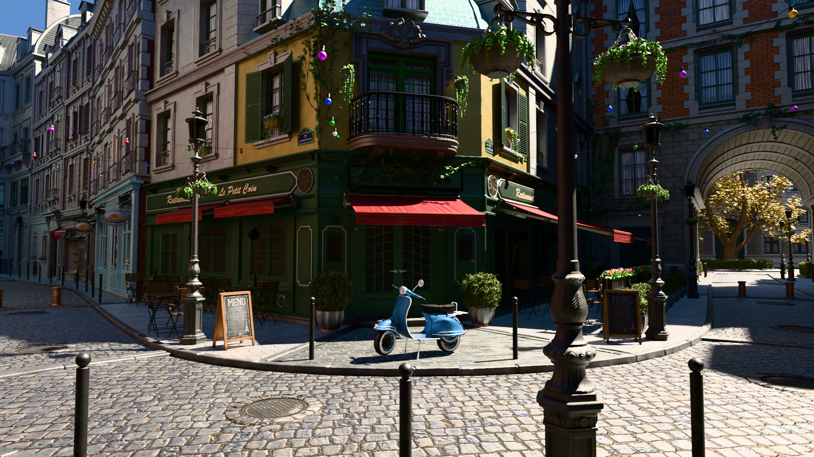
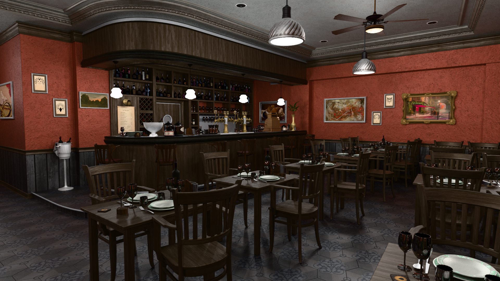
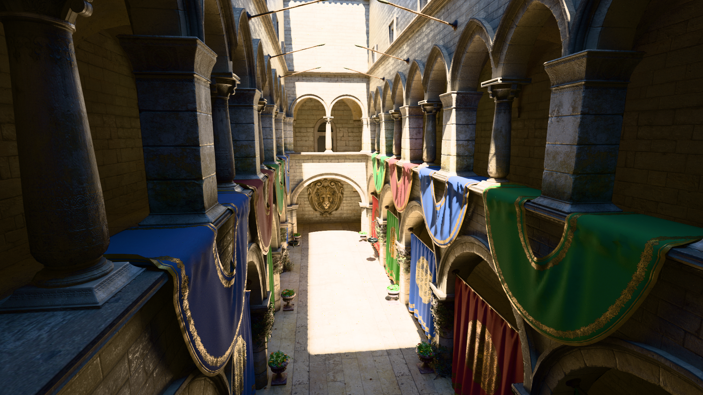
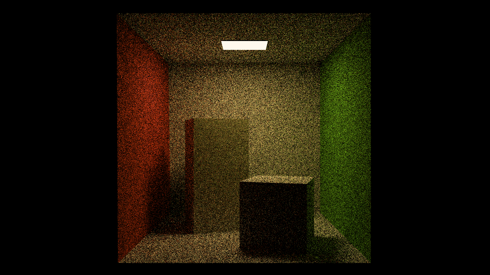
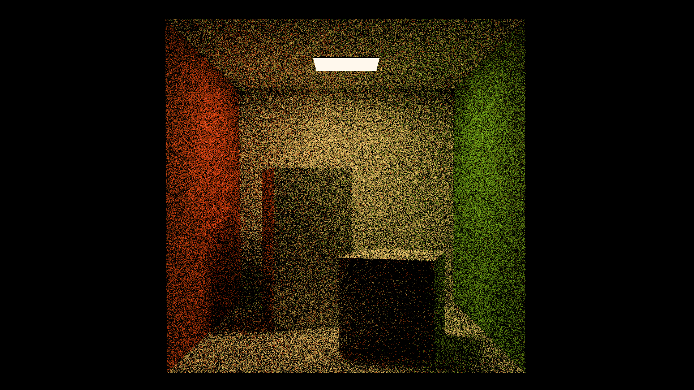
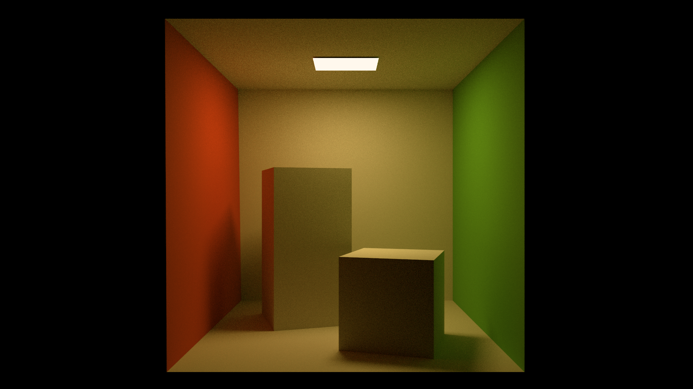

# ⚡ Hardware Accelerated Ray Tracer (HWRT)
> A high performance, physically based, progressive **Path Tracer** built from scratch using **C++20** and **Vulkan**

[](https://mit-license.org/)
[](https://www.microsoft.com/windows/)
[](https://www.linux.org/)
[](https://www.vulkan.org/)
[](https://isocpp.org/)

## 🖼️ Showcase
<p align="center">
  
  <em>Amazon Lumberyard Bistro (exterior)</em>
</p>
<p align="center">
  
  <em>Amazon Lumberyard Bistro (interior)</em>
</p>
<p align="center">
  
  <em>Crytek Sponza</em>
</p>

### 📈 Visual Comparison & Convergence Metrics

The table below demonstrates the visual and mathematical impact of each sampling technique at **64 samples per pixel (spp)** compared to the fully converged ground truth reference.

<table>
  <thead>
    <tr>
      <th align="center">Metric / Method</th>
      <th align="center">Uniform (Naive)</th>
      <th align="center">BRDF Importance</th>
      <th align="center">Next Event Estimation</th>
      <th align="center">Multiple Importance Sampling</th>
      <th align="center">Reference</th>
    </tr>
  </thead>
  <tbody>
    <tr>
      <td align="center"><b>Render Preview</b></td>
      <td align="center"></td>
      <td align="center"></td>
      <td align="center"></td>
      <td align="center"></td>
      <td align="center"></td>
    </tr>
    <tr>
      <td align="center"><b>rMSE</b></td>
      <td align="center">0.581786</td>
      <td align="center">0.435968</td>
      <td align="center">0.006408</td>
      <td align="center">0.006402</td>
      <td align="center">-</td>
    </tr>
    <tr>
      <td align="center"><b>Convergence Boost</b></td>
      <td align="center">1x</td>
      <td align="center">1.33x</td>
      <td align="center">90.80x</td>
      <td align="center"><b>90.87x</b></td>
      <td align="center">-</td>
    </tr>
  </tbody>
</table>


## ✨ Features
* Vulkan Ray Tracing Pipeline
* Unidirectional Path Tracing
* Frame Accumulation
* Cook-Torrance BRDF
* Physically Based Materials
* Next Event Estimation
* Multiple Importance Sampling
* glTF 2.0 Scene Loading
* Mesh Instancing
* Procedural Atmosphere
* Shader Hot Reload
* Khronos PBR Neutral Tone mapping
* Anti-Aliasing

## 🖥️ Requirements
* OS: Windows 10/11 (x64) / Linux (x64)
* GPU: NVIDIA Turing (RTX 20 series) / AMD RDNA 2 (RX 6000 series)
* Vulkan SDK: 1.4
* Compiler: C++20 (GCC, Clang or MinGW)
* CMake: 3.20
* Shader Compiler: The [**Slang**](https://shader-slang.org/) compiler `slangc` must be on your `PATH` if you want to use the `Reload Shaders` feature

## ⚙️ Build & Run

### Clone
```bash
git clone --recursive https://github.com/gavrix32/hwrt.git
cd hwrt

# If you cloned without submodules
git submodule update --init --recursive
```

### Linux

```bash
# Compile shaders (only needed after editing them)
chmod +x src/shaders/compile.sh
./src/shaders/compile.sh

mkdir build && cd build
cmake .. -DCMAKE_BUILD_TYPE=Release
cmake --build . -j$(nproc)
./hwrt -m ../assets/models/cornell_box.glb
```

### Windows

```batch
:: Compile shaders (only needed after editing them)
src\shaders\compile.bat

mkdir build && cd build
cmake ..
cmake --build . --config Release
hwrt.exe -m ..\assets\models\cornell_box.glb
```

## 📃 License

Copyright © 2026 Dmitry Gavrilov

Distributed under the [MIT License](LICENSE).